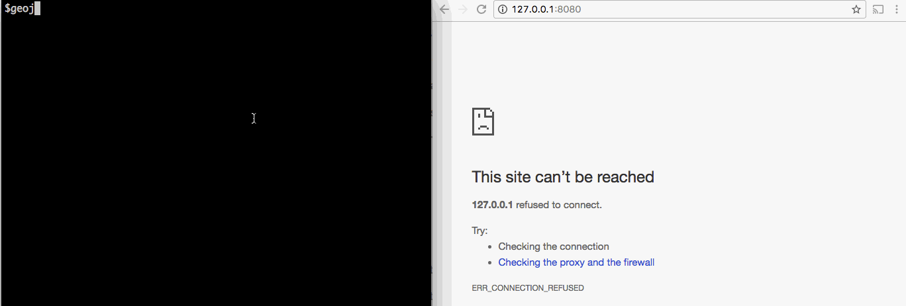

# geojv

Webapp for viewing a GeoJSON map.

#### Install

You need go installed and GOBIN in your PATH. Once that is done, run the command:

```bash
   $ go get -u github.com/ridha/geojv
```

#### Usage

```bash
   $ // set Google API key environment variable
   $ export GOOGLE_API_KEY="your_api_key"
   $ geojv /path/to/geojson.json
   $ geojv http://uri/to/geo.json
```

Then point your browser at: http://127.0.0.1:8080


